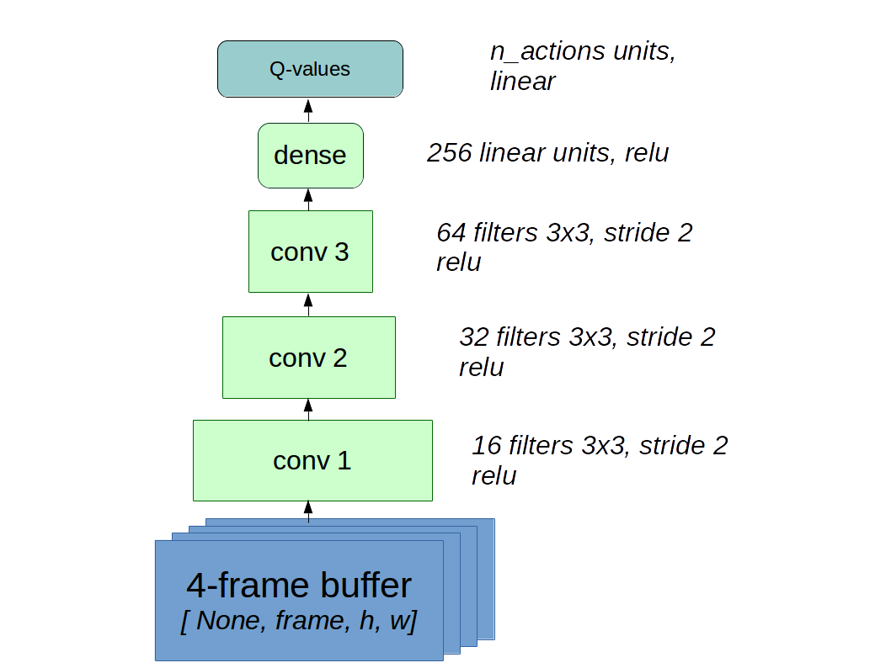
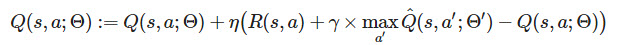
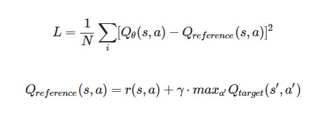
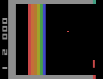

# Break down game with Reinforcement Learning
In this assignment, you will learn how to implement a Deep-Q-Network (DQN), and to demonstrate that, you may implement and train a DQN and run it on an Atari game in OpenAI-Gym environment. Additionally, you may also want to refer to the original paper regarding the usage of DQN in Atari networks. 

In this game you control a space ship that shoots bullets. At each frame, you may either move up, down, or stay still. Every once in a while some meteors colored in red show up at random at the other end of the screen and you should avoid or destroy them. If either one of these meteors hits you, you will die!

To destroy the meteors, you have to shoot them three times and each time you shoot them their color changes until they disappear. They change color from red to orange to yellow and then they are gone. 

# The DQN architecture
We now need to build a neural network that can map images to state q-values. You can build any architecture you want, but for reference, here's something that will more or less work:

# Target Networks
DQN is basically a policy iteration method in which we both approximate the  values and improve them as we go. This might cause any errors in estimating to propagate and create unwanted difficulties. To address this issue we use **Target Networks**. Recall the main Q-Learning framework:

In this framework we approximate the  Q^(s,a′;Θ′)  values using a network parameterized by  Θ′  and this is the actual target network. After certain frequencies we load the current network into the target network.

Here we will finally implement the Q-Learning procedure. Here's the process:

Compute Q-learning TD error with Q-reference defined as :

# Final Result
 
 
